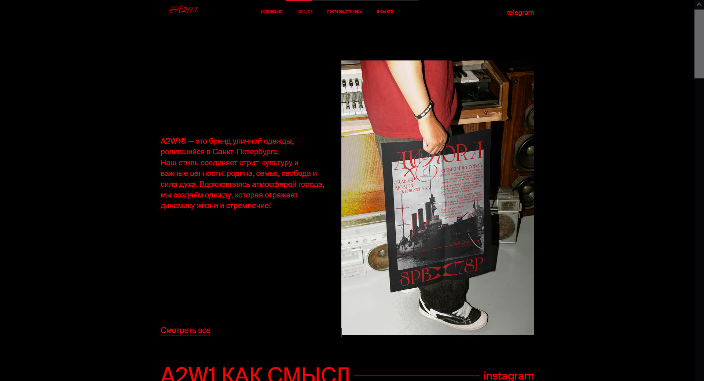
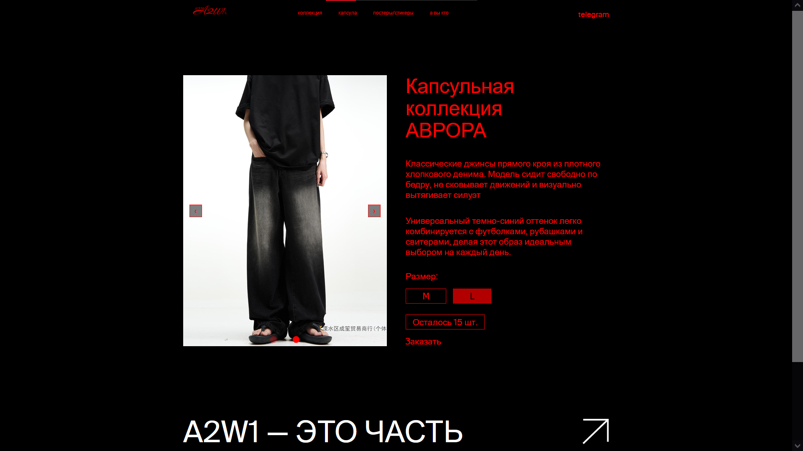
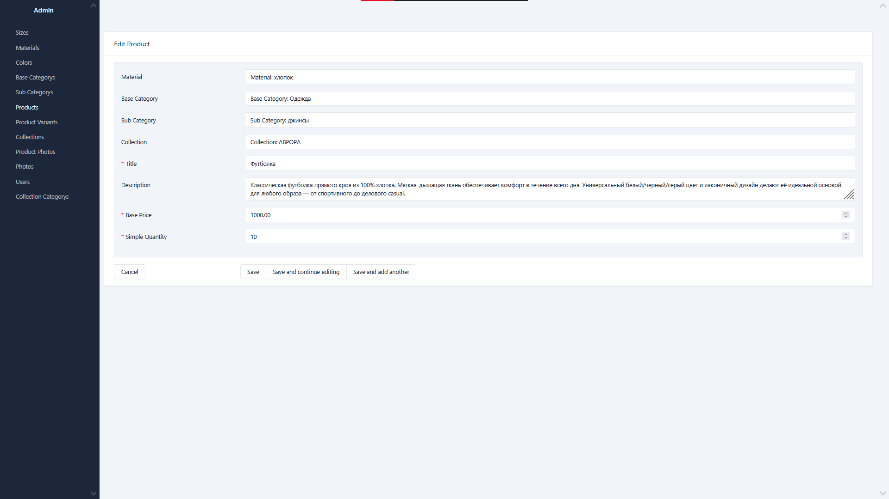
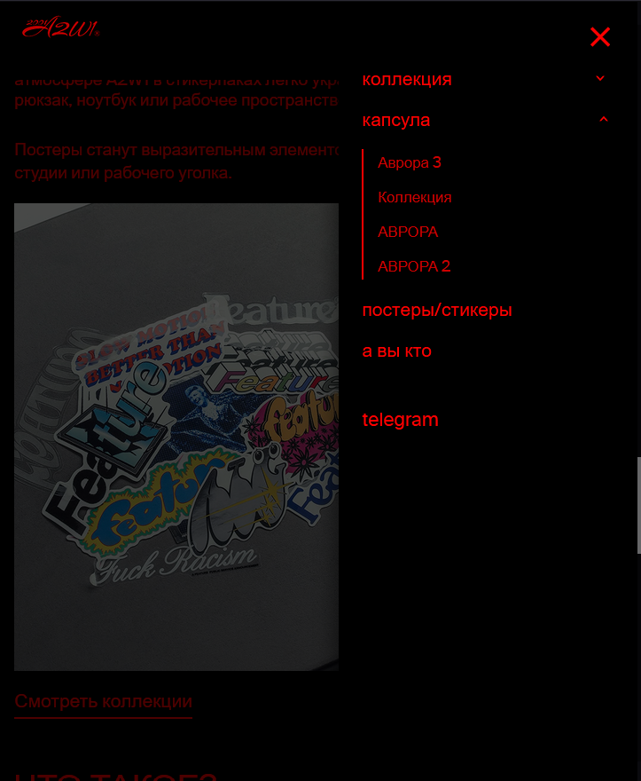

# StoreWay — Clothing Store Backend

Backend часть интернет-магазина одежды и коллекций.

Проект реализован на **FastAPI** с использованием архитектуры **Service Layer + Repository + Unit of Work**. Поддерживает отображение каталога, коллекций, товаров, администрирование контента, загрузку изображений и авторизацию пользователей.

---
## 📷 Demo


https://github.com/user-attachments/assets/5395c334-f00f-42b2-95ae-6655d314122d

[Демо с лучшим качеством](https://www.youtube.com/watch?v=_jhBTeTaGyQ)

---
## 📷 Screenshots

### Home Page


### Product Page


### Admin Panel


### Mobile Version

---

## ✨ Возможности

* Каталог товаров
* Просмотр коллекций и категорий
* Страница отдельного товара
* Административная панель
* Авторизация пользователей через JWT
* Автоматическое обновление access / refresh токенов
* Управление изображениями товаров
* Загрузка и удаление файлов
* Разделение логики по слоям приложения
* Docker запуск

---

## 🏗 Архитектура

Проект построен по слоям:

```text
backend/
│
├── app/
│   ├── api/              # Роуты, зависимости, middleware
│   ├── application/      # Application Services
│   ├── services/         # Бизнес логика
│   ├── repositories/     # Работа с БД
│   ├── db/               # SQLAlchemy модели
│   ├── schemas/          # DTO и схемы
│   ├── static/           # Статические файлы
│   ├── templates/        # Jinja2 шаблоны
│   └── utils/
│
├── Dockerfile
├── requirements.txt
└── .env
```

Используемые паттерны:

* Repository Pattern
* Unit of Work
* Dependency Injection
* DTO
* Service Layer

---

## 🛠 Стек технологий

### Backend

* Python
* FastAPI
* SQLAlchemy
* PostgreSQL
* Pydantic

### Infrastructure

* Docker
* Docker Compose

### Authentication

* JWT
* Cookies

### Admin

* SQLAdmin

### Other

* Jinja2
* Alembic
* Logging
* AsyncIO

---

## 🚀 Запуск проекта

### 1. Клонирование проекта

```bash
git clone https://github.com/fidryc/store-a2w1-fastapi.git

```

---

### 2. Создать `.env`

Перейдите в папку `backend` и создайте `.env` на основе примера:

```bash
cd backend

cp .env.example .env
```

Для Windows (PowerShell):

```powershell
copy .env.example .env
```

При необходимости измените значения внутри `.env`.

---

### 3. Запуск через Docker

Вернитесь в корень проекта:

```bash
docker compose up --build
```

---

### 4. Открыть приложение

```text
Frontend:
http://localhost:8000

Admin:
http://localhost:8000/admin

OpenAPI (только для администратора):
http://localhost:8000/docs
```

---


## 🔐 Авторизация

Авторизация построена через:

* Access Token
* Refresh Token
* Cookie Based Authentication

Документация API доступна только администраторам.

---

## 📦 Основной функционал API

### Пользователи

```http
POST /api/v1/users/login
```

Авторизация пользователя.

---

### Изображения

```http
POST /api/v1/images/upload-file
DELETE /api/v1/images/delete-file
```

Управление изображениями.

---

## 📷 Администрирование

Через админ панель можно:

* управлять товарами
* загружать изображения
* создавать коллекции
* управлять категориями
* просматривать пользователей

---

## 📌 Что было реализовано

* Асинхронная работа с БД
* Разделение бизнес логики
* Универсальный слой репозиториев
* JWT авторизация
* Административный интерфейс
* Работа с изображениями
* Docker окружение

[Watch demo](https://youtu.be/_jhBTeTaGyQ)
